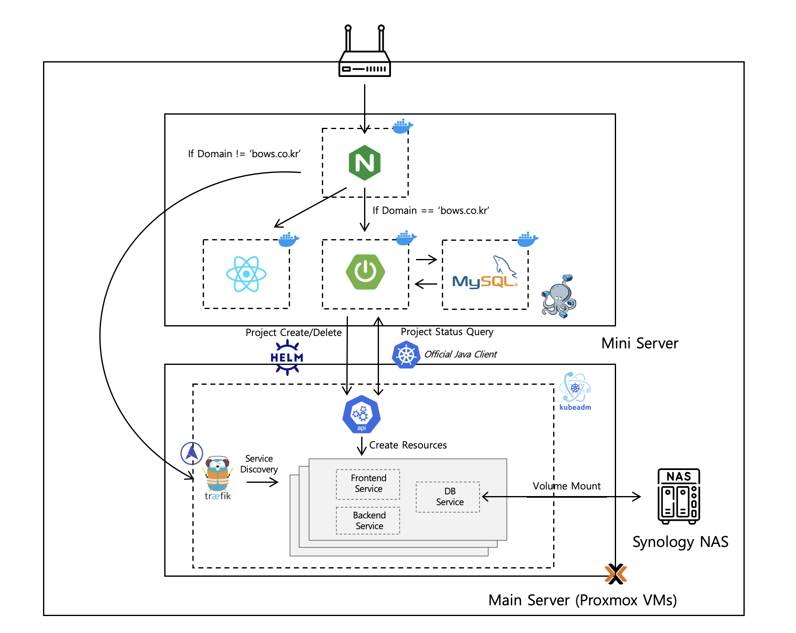

## BoWS - 코드스쿼드 멤버들을 위한 쿠버네티스 기반 호스팅 서비스

### ✅ 프로젝트 소개
- 간편하게, 무료로 프로젝트를 온프레미스 k8s 클러스터에 배포할 수 있는 플랫폼 서비스입니다.
- Docker Hub에서의 이미지 이름, Storage Size 등의 정보를 form 형태로 작성하여 제출합니다.
- 제출된 정보를 바탕으로 Helm command가 생성되어 k8s 클러스터에 프로젝트가 배포됩니다.
- 배포된 프로젝트의 상태를 조회할 수 있습니다.
  - 비정상 상태인 경우 그 세부 내용을 조회할 수 있습니다.

 

### 🏛️ 서비스 아키텍쳐

 
 

### 🛠️ 기술 스택
#### Backend

  
  
  
  
  
 

#### Infra

  
  
   
  
  

#### Frontend

  

  

